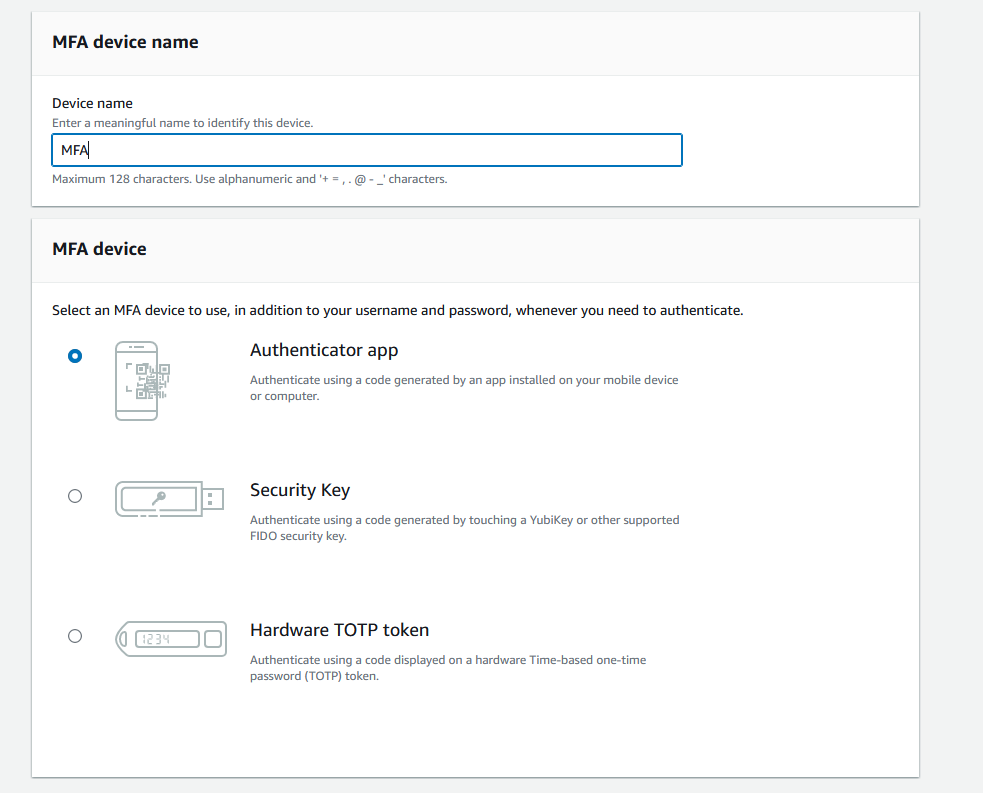
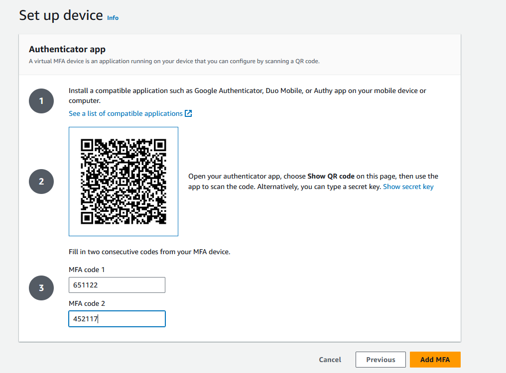

# Enable MFA on AWS

## Step-by-Step Guide

1. **Navigate to the IAM Dashboard:**
   - Log in to the AWS Management Console.
   - Open the IAM dashboard by selecting "IAM" from the services list or by searching for "IAM" in the search bar.

   

2. **Activate MFA:**
   - In the IAM dashboard, look for the security status section. You will see a recommendation to activate MFA for your root account. Click on "Manage MFA".

   

3. **Set Up a Virtual MFA Device:**
   - Choose "Add MFA".
   - Follow the instructions to set up the virtual MFA device, which typically involves scanning a QR code with your authenticator app and entering two consecutive six-digit codes generated by the app.

   
   

> [!NOTE]
> The six-digit code generated by your authenticator app will change every 30 seconds.

## Alternate Method

- **Access User Settings:**
  - From the IAM dashboard, click on "Users" in the left navigation pane under "Access Management".
  - Select your username to view your user details.

  

- **Assign MFA Device:**
  - Navigate to the "Security Credentials" tab.
  - Here, you will find options to manage your MFA device. Click on "Assign MFA device" to add a new MFA device.
  - Follow steps in point 3.

  

By following these steps, you can enable MFA for your AWS account, adding an extra layer of security to your cloud resources.
