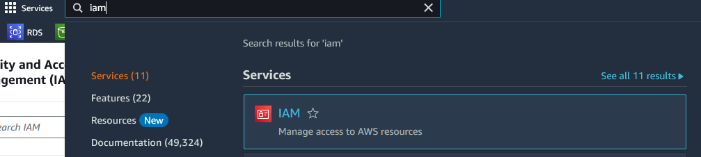
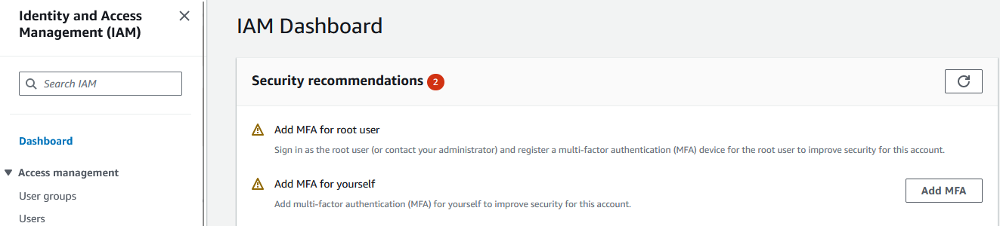
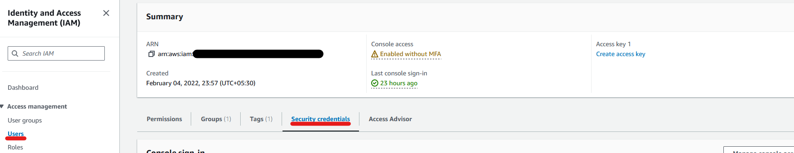
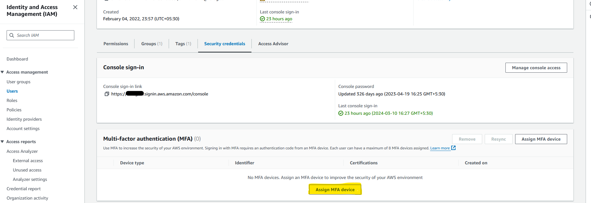

# Enable MFA on AWS

1. Navigate to IAM on AWS Console.
 
    

2. You will be prompted to add MFA for your user under security recommendations.

    

## Alternate Way

- Follow point 1.

- Navigate to `Users` in the left pane under `Access Management`. Click on your username and navigate to `Security Credentials` tab.

    

- Under `Security Credentials` tab, You will find options to add MFA device.

    